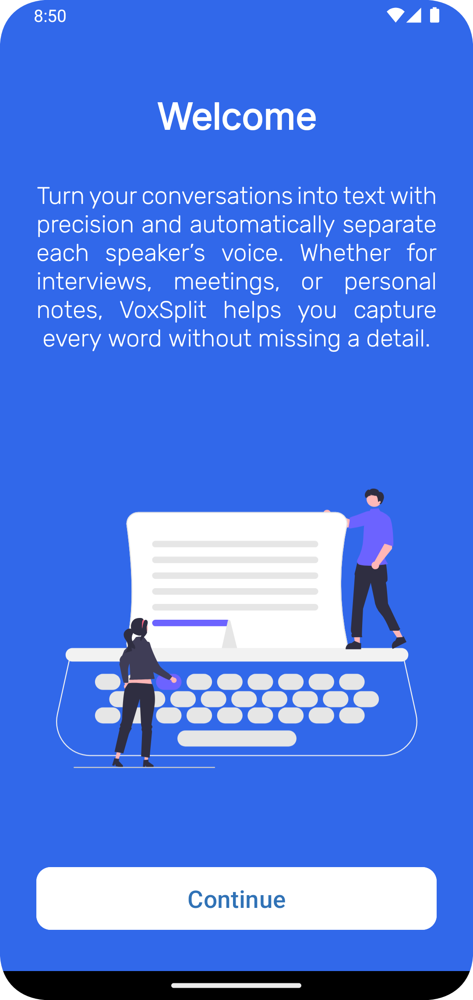
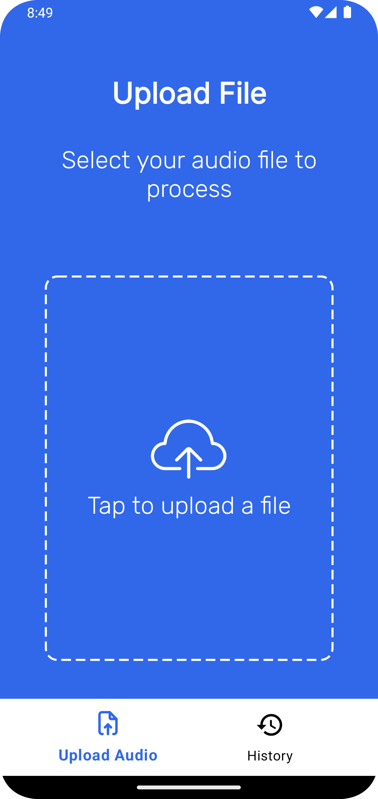
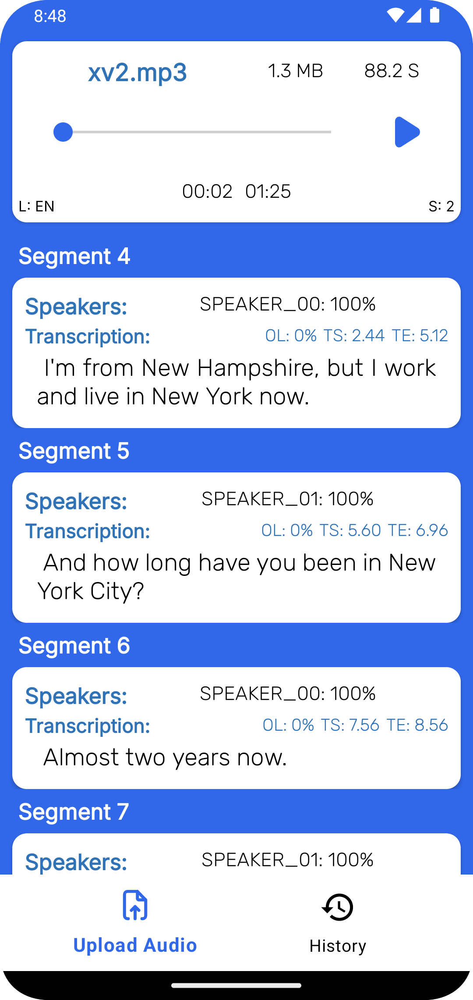
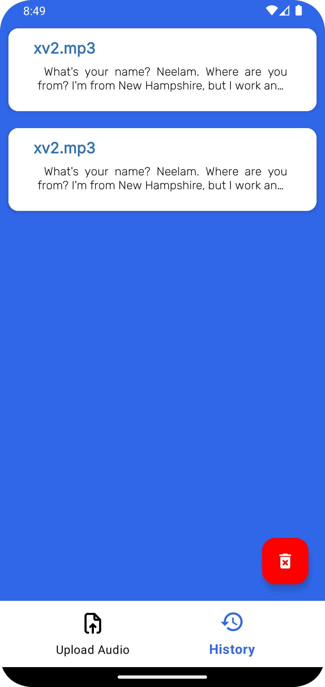
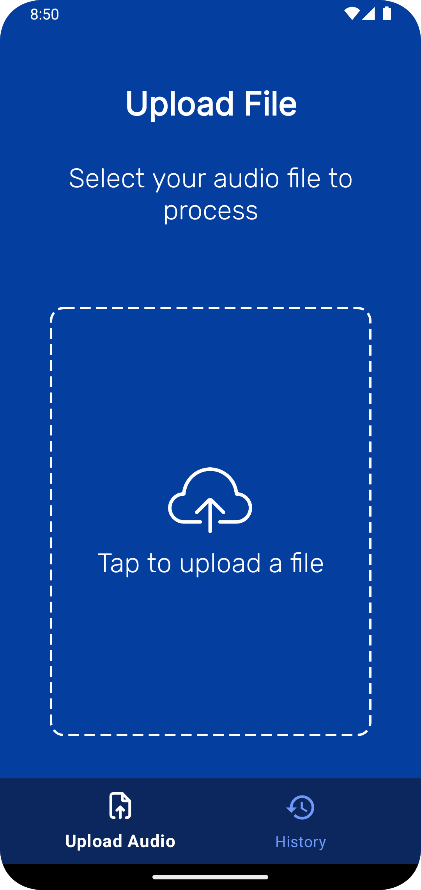
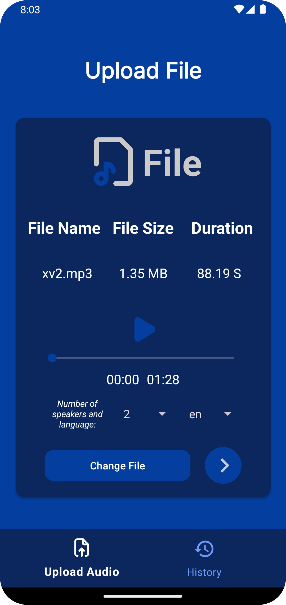
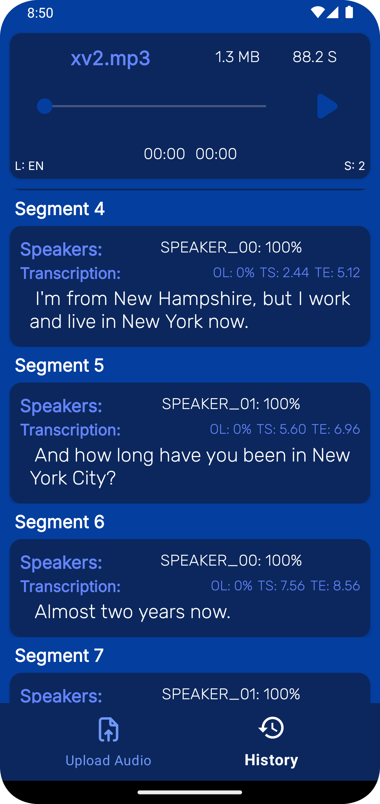

# VoxSplit
Turn your conversations into text with precision and automatically separate each speaker’s voice. Whether for interviews, meetings, or personal notes, **VoxSplit** helps you capture every word without missing a detail.

## Features
...

## Tech Stack
...

## Usage
...

## Screenshots
- 🏠 Welcome Dialog

   

- Audio File Upload

   

-  Audio File Summary

   

- Result of Audio File Processing

   

- History of Processed Audio Files

   

- Dark Mode

   
  
  

